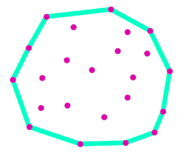

# Convex Hull

This library computes the [convex hull](https://en.wikipedia.org/wiki/Convex_hull) of a set of points.

It uses the __Graham scan__ algorithm.

References:

- [Wikipedia](https://en.wikipedia.org/wiki/Graham_scan)
- [Algorithm Archive](https://www.algorithm-archive.org/contents/graham_scan/graham_scan.html)
- This code is largely inspired by this [Geeksforgeeks's post](https://www.geeksforgeeks.org/convex-hull-using-graham-scan/).


## Installation

Copy `./lib/points.js` and `./lib/convexHull.js` files.

Point are objects with `x` and `y` properties representing their coordinates.

## Usage

```js
import ConvexHull from './lib/convexHull.js';

let points =[
    new Point(17, 16),
    new Point(35, 4),
    new Point(26, 45),
    new Point(43, 25),
    new Point(65, 21),
];

let hull = new ConvexHull(points);
console.log(hull.getPoints());
```
Result :

```js
[
  Point { x: 26, y: 45 },
  Point { x: 17, y: 16 },
  Point { x: 35, y: 4 },
  Point { x: 65, y: 21 }
]
```
__Notes__:
- The resulting points are ordered starting from the lowest left, then following the envelope clockwise.
- The path is not closed (the last point is not the same as the first).

## Ideas

- Optimize the code by _interior elimination_ (or _quadrilateral culling_) : find the farthest points in the NW, NE, SE & SW directions and eliminate the points inside the quadrilateral they defined (as these points cannot be on the hull).
- Implement other algorithms, like [Quickhull](https://en.wikipedia.org/wiki/Quickhull).